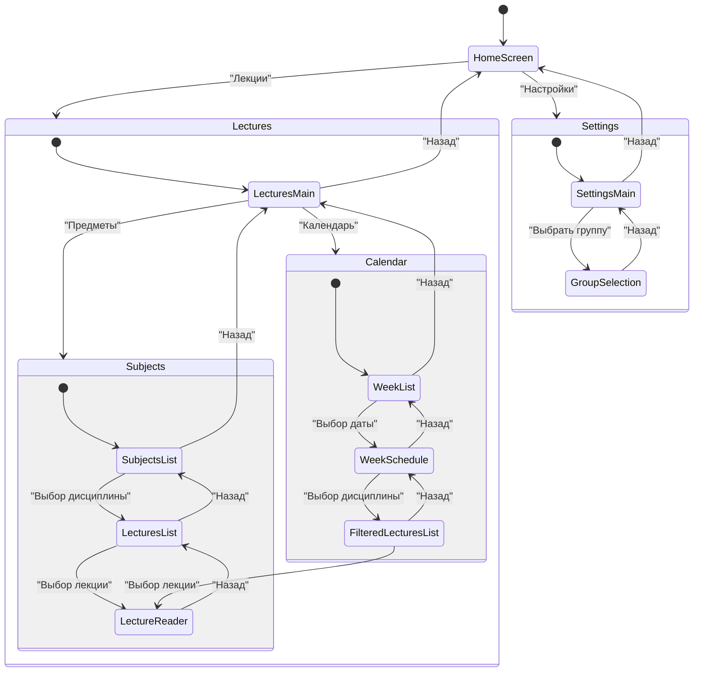

```mermaid
stateDiagram-v2
    [*] --> HomeScreen

    HomeScreen --> Lectures: "Лекции"
    HomeScreen --> Settings: "Настройки"

    state Lectures {
        [*] --> LecturesMain
        LecturesMain --> Subjects: "Предметы"
        LecturesMain --> Calendar: "Календарь"
        
        state Subjects {
            [*] --> SubjectsList
            SubjectsList --> LecturesList: "Выбор дисциплины"
            LecturesList --> LectureReader: "Выбор лекции"
        }

        state Calendar {
            [*] --> WeekList
            WeekList --> WeekSchedule: "Выбор даты"
            WeekSchedule --> FilteredLecturesList: "Выбор дисциплины"
        }
    }

    state Settings {
        [*] --> SettingsMain
        SettingsMain --> GroupSelection: "Выбрать группу"
    }

    %% Навигация "Назад"
    LecturesMain --> HomeScreen: "Назад"
    SubjectsList --> LecturesMain: "Назад"
    LecturesList --> SubjectsList: "Назад"
    LectureReader --> LecturesList: "Назад"
    
    WeekList --> LecturesMain: "Назад"
    WeekSchedule --> WeekList: "Назад"
    FilteredLecturesList --> WeekSchedule: "Назад"
    
    SettingsMain --> HomeScreen: "Назад"
    GroupSelection --> SettingsMain: "Назад"

    %% Особые связи
    FilteredLecturesList --> LectureReader: "Выбор лекции"
```