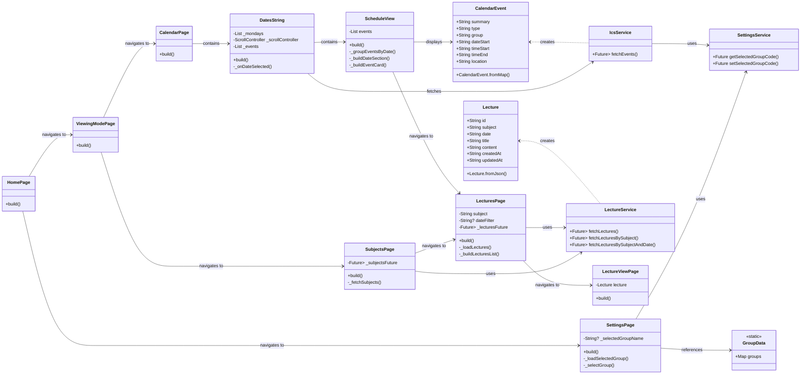

```mermaid
classDiagram
    direction LR

    class CalendarEvent {
        +String summary
        +String type
        +String group
        +String dateStart
        +String timeStart
        +String timeEnd
        +String location
        +CalendarEvent.fromMap()
    }

    class Lecture {
        +String id
        +String subject
        +String date
        +String title
        +String content
        +String createdAt
        +String updatedAt
        +Lecture.fromJson()
    }

    class IcsService {
        +Future<List<CalendarEvent>> fetchEvents()
    }

    class LectureService {
        +Future<List<Lecture>> fetchLectures()
        +Future<List<Lecture>> fetchLecturesBySubject()
        +Future<List<Lecture>> fetchLecturesBySubjectAndDate()
    }

    class SettingsService {
        +Future<String?> getSelectedGroupCode()
        +Future<void> setSelectedGroupCode()
    }

    class DatesString {
        -List<DateTime> _mondays
        -ScrollController _scrollController
        -List<CalendarEvent> _events
        +build()
        -_onDateSelected()
    }

    class ScheduleView {
        -List<CalendarEvent> events
        +build()
        -_groupEventsByDate()
        -_buildDateSection()
        -_buildEventCard()
    }

    class LecturesPage {
        -String subject
        -String? dateFilter
        -Future<List<Lecture>> _lecturesFuture
        +build()
        -_loadLectures()
        -_buildLecturesList()
    }

    class LectureViewPage {
        -Lecture lecture
        +build()
    }

    class SubjectsPage {
        -Future<List<String>> _subjectsFuture
        +build()
        -_fetchSubjects()
    }

    class SettingsPage {
        -String? _selectedGroupName
        +build()
        -_loadSelectedGroup()
        -_selectGroup()
    }

    class ViewingModePage {
        +build()
    }

    class HomePage {
        +build()
    }

    class CalendarPage {
        +build()
    }

    class GroupData {
        <<static>>
        +Map<String, String> groups
    }

    CalendarEvent <.. IcsService : creates
    Lecture <.. LectureService : creates
    IcsService --> SettingsService : uses
    DatesString --> IcsService : fetches
    DatesString --> ScheduleView : contains
    ScheduleView --> CalendarEvent : displays
    ScheduleView --> LecturesPage : navigates to
    LecturesPage --> LectureService : uses
    LecturesPage --> LectureViewPage : navigates to
    SubjectsPage --> LectureService : uses
    SubjectsPage --> LecturesPage : navigates to
    SettingsPage --> SettingsService : uses
    SettingsPage --> GroupData : references
    ViewingModePage --> SubjectsPage : navigates to
    ViewingModePage --> CalendarPage : navigates to
    HomePage --> ViewingModePage : navigates to
    HomePage --> SettingsPage : navigates to
    CalendarPage --> DatesString : contains
```
